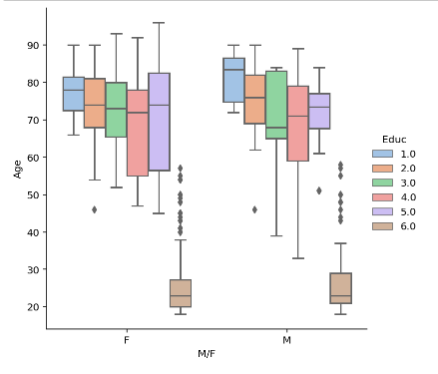

```python
import pandas as pd
import matplotlib.pyplot as plt
import seaborn as sns
```

Importing a dataset from Kaggle.com of MRI data sets.


```python
df = pd.read_csv('oasis_cross-sectional.csv')
```


```python
df
```


<table border="1" class="dataframe">
  <thead>
    <tr style="text-align: right;">
      <th></th>
      <th>ID</th>
      <th>M/F</th>
      <th>Hand</th>
      <th>Age</th>
      <th>Educ</th>
      <th>SES</th>
      <th>MMSE</th>
      <th>CDR</th>
      <th>eTIV</th>
      <th>nWBV</th>
      <th>ASF</th>
      <th>Delay</th>
    </tr>
  </thead>
  <tbody>
    <tr>
      <th>0</th>
      <td>OAS1_0001_MR1</td>
      <td>F</td>
      <td>R</td>
      <td>74</td>
      <td>2.0</td>
      <td>3.0</td>
      <td>29.0</td>
      <td>0.0</td>
      <td>1344</td>
      <td>0.743</td>
      <td>1.306</td>
      <td>NaN</td>
    </tr>
    <tr>
      <th>1</th>
      <td>OAS1_0002_MR1</td>
      <td>F</td>
      <td>R</td>
      <td>55</td>
      <td>4.0</td>
      <td>1.0</td>
      <td>29.0</td>
      <td>0.0</td>
      <td>1147</td>
      <td>0.810</td>
      <td>1.531</td>
      <td>NaN</td>
    </tr>
    <tr>
      <th>2</th>
      <td>OAS1_0003_MR1</td>
      <td>F</td>
      <td>R</td>
      <td>73</td>
      <td>4.0</td>
      <td>3.0</td>
      <td>27.0</td>
      <td>0.5</td>
      <td>1454</td>
      <td>0.708</td>
      <td>1.207</td>
      <td>NaN</td>
    </tr>
    <tr>
      <th>3</th>
      <td>OAS1_0004_MR1</td>
      <td>M</td>
      <td>R</td>
      <td>28</td>
      <td>NaN</td>
      <td>NaN</td>
      <td>NaN</td>
      <td>NaN</td>
      <td>1588</td>
      <td>0.803</td>
      <td>1.105</td>
      <td>NaN</td>
    </tr>
    <tr>
      <th>4</th>
      <td>OAS1_0005_MR1</td>
      <td>M</td>
      <td>R</td>
      <td>18</td>
      <td>NaN</td>
      <td>NaN</td>
      <td>NaN</td>
      <td>NaN</td>
      <td>1737</td>
      <td>0.848</td>
      <td>1.010</td>
      <td>NaN</td>
    </tr>
    <tr>
      <th>...</th>
      <td>...</td>
      <td>...</td>
      <td>...</td>
      <td>...</td>
      <td>...</td>
      <td>...</td>
      <td>...</td>
      <td>...</td>
      <td>...</td>
      <td>...</td>
      <td>...</td>
      <td>...</td>
    </tr>
    <tr>
      <th>431</th>
      <td>OAS1_0285_MR2</td>
      <td>M</td>
      <td>R</td>
      <td>20</td>
      <td>NaN</td>
      <td>NaN</td>
      <td>NaN</td>
      <td>NaN</td>
      <td>1469</td>
      <td>0.847</td>
      <td>1.195</td>
      <td>2.0</td>
    </tr>
    <tr>
      <th>432</th>
      <td>OAS1_0353_MR2</td>
      <td>M</td>
      <td>R</td>
      <td>22</td>
      <td>NaN</td>
      <td>NaN</td>
      <td>NaN</td>
      <td>NaN</td>
      <td>1684</td>
      <td>0.790</td>
      <td>1.042</td>
      <td>40.0</td>
    </tr>
    <tr>
      <th>433</th>
      <td>OAS1_0368_MR2</td>
      <td>M</td>
      <td>R</td>
      <td>22</td>
      <td>NaN</td>
      <td>NaN</td>
      <td>NaN</td>
      <td>NaN</td>
      <td>1580</td>
      <td>0.856</td>
      <td>1.111</td>
      <td>89.0</td>
    </tr>
    <tr>
      <th>434</th>
      <td>OAS1_0379_MR2</td>
      <td>F</td>
      <td>R</td>
      <td>20</td>
      <td>NaN</td>
      <td>NaN</td>
      <td>NaN</td>
      <td>NaN</td>
      <td>1262</td>
      <td>0.861</td>
      <td>1.390</td>
      <td>2.0</td>
    </tr>
    <tr>
      <th>435</th>
      <td>OAS1_0395_MR2</td>
      <td>F</td>
      <td>R</td>
      <td>26</td>
      <td>NaN</td>
      <td>NaN</td>
      <td>NaN</td>
      <td>NaN</td>
      <td>1283</td>
      <td>0.834</td>
      <td>1.368</td>
      <td>39.0</td>
    </tr>
  </tbody>
</table>
<p>436 rows × 12 columns</p>
</div>


The seaborn library can be used to visualize this data, specifically the columns age, sex and education level.


```python
sns.catplot(kind = 'box', data = df, y = 'Age', x = 'M/F', hue = 'Educ', palette = 'pastel')

plt.show()
```


    

    


In the above graph, outliers, the NaN values, are not displayed. They can be displayed if we mask Nan values in the dataframe. The following steps will explain how this is done.

Calling the .unique() function on df['Educ'] shows all values in this column. This is performed so I do not mask over an existing value.


```python
df['Educ'].unique()
```


    array([ 2.,  4., nan,  5.,  3.,  1.])


A mask can be used to drop NaN values and replace them with a number. This will facilitate data visualization.

I replaced all NaN values in the Education column with 6 so that when graphed, it is clear who falls in which Education category.


```python
df2 = df.mask(df.isna(), 6)
df2
```


<table border="1" class="dataframe">
  <thead>
    <tr style="text-align: right;">
      <th></th>
      <th>ID</th>
      <th>M/F</th>
      <th>Hand</th>
      <th>Age</th>
      <th>Educ</th>
      <th>SES</th>
      <th>MMSE</th>
      <th>CDR</th>
      <th>eTIV</th>
      <th>nWBV</th>
      <th>ASF</th>
      <th>Delay</th>
    </tr>
  </thead>
  <tbody>
    <tr>
      <th>0</th>
      <td>OAS1_0001_MR1</td>
      <td>F</td>
      <td>R</td>
      <td>74</td>
      <td>2.0</td>
      <td>3.0</td>
      <td>29.0</td>
      <td>0.0</td>
      <td>1344</td>
      <td>0.743</td>
      <td>1.306</td>
      <td>6.0</td>
    </tr>
    <tr>
      <th>1</th>
      <td>OAS1_0002_MR1</td>
      <td>F</td>
      <td>R</td>
      <td>55</td>
      <td>4.0</td>
      <td>1.0</td>
      <td>29.0</td>
      <td>0.0</td>
      <td>1147</td>
      <td>0.810</td>
      <td>1.531</td>
      <td>6.0</td>
    </tr>
    <tr>
      <th>2</th>
      <td>OAS1_0003_MR1</td>
      <td>F</td>
      <td>R</td>
      <td>73</td>
      <td>4.0</td>
      <td>3.0</td>
      <td>27.0</td>
      <td>0.5</td>
      <td>1454</td>
      <td>0.708</td>
      <td>1.207</td>
      <td>6.0</td>
    </tr>
    <tr>
      <th>3</th>
      <td>OAS1_0004_MR1</td>
      <td>M</td>
      <td>R</td>
      <td>28</td>
      <td>6.0</td>
      <td>6.0</td>
      <td>6.0</td>
      <td>6.0</td>
      <td>1588</td>
      <td>0.803</td>
      <td>1.105</td>
      <td>6.0</td>
    </tr>
    <tr>
      <th>4</th>
      <td>OAS1_0005_MR1</td>
      <td>M</td>
      <td>R</td>
      <td>18</td>
      <td>6.0</td>
      <td>6.0</td>
      <td>6.0</td>
      <td>6.0</td>
      <td>1737</td>
      <td>0.848</td>
      <td>1.010</td>
      <td>6.0</td>
    </tr>
    <tr>
      <th>...</th>
      <td>...</td>
      <td>...</td>
      <td>...</td>
      <td>...</td>
      <td>...</td>
      <td>...</td>
      <td>...</td>
      <td>...</td>
      <td>...</td>
      <td>...</td>
      <td>...</td>
      <td>...</td>
    </tr>
    <tr>
      <th>431</th>
      <td>OAS1_0285_MR2</td>
      <td>M</td>
      <td>R</td>
      <td>20</td>
      <td>6.0</td>
      <td>6.0</td>
      <td>6.0</td>
      <td>6.0</td>
      <td>1469</td>
      <td>0.847</td>
      <td>1.195</td>
      <td>2.0</td>
    </tr>
    <tr>
      <th>432</th>
      <td>OAS1_0353_MR2</td>
      <td>M</td>
      <td>R</td>
      <td>22</td>
      <td>6.0</td>
      <td>6.0</td>
      <td>6.0</td>
      <td>6.0</td>
      <td>1684</td>
      <td>0.790</td>
      <td>1.042</td>
      <td>40.0</td>
    </tr>
    <tr>
      <th>433</th>
      <td>OAS1_0368_MR2</td>
      <td>M</td>
      <td>R</td>
      <td>22</td>
      <td>6.0</td>
      <td>6.0</td>
      <td>6.0</td>
      <td>6.0</td>
      <td>1580</td>
      <td>0.856</td>
      <td>1.111</td>
      <td>89.0</td>
    </tr>
    <tr>
      <th>434</th>
      <td>OAS1_0379_MR2</td>
      <td>F</td>
      <td>R</td>
      <td>20</td>
      <td>6.0</td>
      <td>6.0</td>
      <td>6.0</td>
      <td>6.0</td>
      <td>1262</td>
      <td>0.861</td>
      <td>1.390</td>
      <td>2.0</td>
    </tr>
    <tr>
      <th>435</th>
      <td>OAS1_0395_MR2</td>
      <td>F</td>
      <td>R</td>
      <td>26</td>
      <td>6.0</td>
      <td>6.0</td>
      <td>6.0</td>
      <td>6.0</td>
      <td>1283</td>
      <td>0.834</td>
      <td>1.368</td>
      <td>39.0</td>
    </tr>
  </tbody>
</table>
<p>436 rows × 12 columns</p>
</div>


A visual representation of the age, sex and education level of participants in this study. The brown box (education of 6.0) is actually the masked value (NaN). 


```python
sns.catplot(kind = 'box', data = df2, y = 'Age', x = 'M/F', hue = 'Educ', palette = 'pastel')

plt.show()
```


    

    


```python

```
